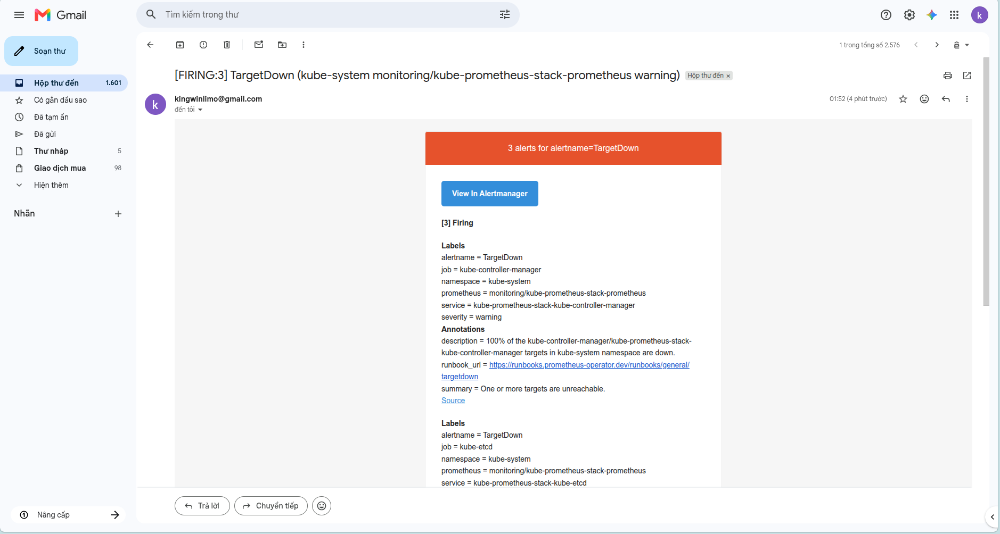

# Hướng Dẫn Vận Hành GitOps API Service: Canary Auto-Abort & Observability

Tài liệu này giải thích chi tiết về thiết kế đo lường (Observability), cách cấu hình cảnh báo, và cơ chế tự động hoá Canary (Auto-Abort & Rollback) được triển khai trong bài Lab.

---

## 1. Giải Thích Đo Lường & Cảnh Báo (Observability)

### 1.1. Query Prometheus Đo Lường Success Rate (Trong AnalysisTemplate)
Để tự động hoá việc đánh giá chất lượng phiên bản mới, ta sử dụng tài nguyên `AnalysisTemplate` truy vấn Prometheus định kỳ mỗi `10s` trong vòng 1 phút (`count: 6`):

```yaml
query: |
  1 - (
    (sum(rate(flask_http_request_total{status="500", namespace="demo", job="api"}[1m])) or vector(0))
    /
    (sum(rate(flask_http_request_total{namespace="demo", job="api"}[1m])) or vector(1))
  )
```

**Giải thích công thức:**
* `flask_http_request_total`: Metric đếm số lượng HTTP request gửi tới ứng dụng Python Flask.
* `status="500"`: Lọc ra các request bị lỗi hệ thống.
* `rate(...[1m])`: Tính tốc độ số lượng request lỗi/thành công phát sinh trên mỗi giây trong khoảng thời gian 1 phút gần nhất.
* `or vector(...)`: Xử lý giá trị rỗng (tránh lỗi chia cho 0 hoặc trả về kết quả rỗng khi không có request).
* Công thức tính: `Success Rate = 1 - (Số request lỗi 500 / Tổng số request)`.
* **Ngưỡng an toàn (Threshold)**: `>= 0.95` (Tỷ lệ thành công phải đạt từ 95% trở lên). Nếu tỷ lệ thành công sụt giảm dưới 95%, hệ thống sẽ đánh dấu lần kiểm tra đó là **thất bại (Failed)**.
* **Ngưỡng huỷ bỏ (Failure Limit)**: `failureLimit: 1` (Chỉ cho phép tối đa 1 lần lỗi. Từ lần lỗi thứ 2 trở đi, tiến trình Canary sẽ bị dừng ngay lập tức).

### 1.2. Luật Cảnh Báo Prometheus Rule (Trong prometheus-rules.yaml)
Cấu hình cảnh báo hệ thống thông qua `PrometheusRule`:

```yaml
expr: |
  (sum(rate(flask_http_request_total{status="500", namespace="demo", job="api"}[2m])) or vector(0))
  /
  (sum(rate(flask_http_request_total{namespace="demo", job="api"}[2m])) or vector(1)) > 0.05
```

**Giải thích:**
* Nếu tỷ lệ lỗi HTTP 500 của dịch vụ API vượt quá **5%** (`> 0.05`) liên tục trong vòng **2 phút**, cảnh báo `ApiHighErrorRate` ở mức độ `critical` sẽ kích hoạt trạng thái **Firing**.
* Alertmanager sẽ bắt tín hiệu này, đóng gói và thực hiện gửi email thông báo về địa chỉ Gmail cá nhân của bạn thông qua máy chủ SMTP của Google.

---

## 2. Hướng Dẫn Lấy Ảnh/Clip Minh Chứng (Chứng Minh Bài Lab)

Dưới đây là các minh chứng bạn cần chụp lại để chèn vào báo cáo của mình:

### 2.1. Minh Chứng 1: Canary Auto-Abort & Rollback tự động trên Terminal
Bạn có thể chụp lại ảnh màn hình chạy lệnh `kubectl argo rollouts get rollout api -n demo --watch` khi hệ thống tự động huỷ bỏ triển khai.

> [!TIP]
> **Nơi chụp:** Sử dụng trực tiếp ảnh terminal bạn vừa chụp. 
> * **Đặc điểm nhận dạng:** 
>   * Status báo: `✖ Degraded`
>   * Message báo: `RolloutAborted: Rollout aborted update to revision 5: Metric "success-rate" assessed Failed due to failed (2) > failureLimit (1)`
>   * `revision:5` bị co lại (`ScaledDown`), `AnalysisRun` ở trạng thái `✖ Failed`.
>   * Lưu lượng truy cập tự động trả về 100% cho `revision:4` (stable).

*(Chèn ảnh chụp màn hình terminal của bạn vào đây)*

---

### 2.2. Minh Chứng 2: Trạng thái trực quan trên ArgoCD UI
* **Nơi chụp:** Mở trình duyệt web truy cập vào giao diện ArgoCD Dashboard (đang được port-forward tại `http://localhost:8080`).
* **Mục tiêu:** Chụp lại sơ đồ tài nguyên của ứng dụng `api`.
* **Đặc điểm nhận dạng:** Bạn sẽ thấy đối tượng `AnalysisRun` có biểu tượng màu đỏ báo hiệu thất bại (`Failed`) và Rollout tự động quay ngược đầu chỉ mũi tên về ReplicaSet phiên bản trước đó mà không có lỗi.

*(Chèn ảnh giao diện ArgoCD UI vào đây)*

---

### 2.3. Minh Chứng 3: Đồ thị cảnh báo trên Prometheus UI
* **Nơi chụp:** Mở trình duyệt web truy cập Prometheus UI (đang chạy trên cổng 9090 của cụm).
* **Mục tiêu:** 
  1. Vào tab **Alerts**: Tìm cảnh báo `ApiHighErrorRate`, lúc này nó sẽ chuyển sang màu đỏ rực kèm chữ **FIRING**.
  2. Vào tab **Graph**: Nhập truy vấn `flask_http_request_total` để thấy đường đồ thị các request lỗi 500 tăng vọt khi bản lỗi Canary được kích hoạt.

*(Chèn ảnh giao diện Alerts trên Prometheus vào đây)*

---

### 2.4. Minh Chứng 4: Email Cảnh Báo Gửi Về Gmail Cá Nhân
* **Nơi chụp:** Mở hộp thư Gmail cá nhân của bạn (`kingwinlimo@gmail.com`).
* **Đặc điểm nhận dạng:** Tìm kiếm email gửi đến từ `alertmanager@devops-lab.com` (hoặc email gửi từ chính bạn). 
  * Tiêu đề/Nội dung email sẽ hiển thị thông tin cảnh báo: `[FIRING:1] ApiHighErrorRate`.
  * Nội dung chi tiết chứa thông tin: `"API high error rate detected"`.
  * *Lưu ý: Nếu không thấy ở hộp thư đến, hãy kiểm tra cả mục Thư rác (Spam).*
